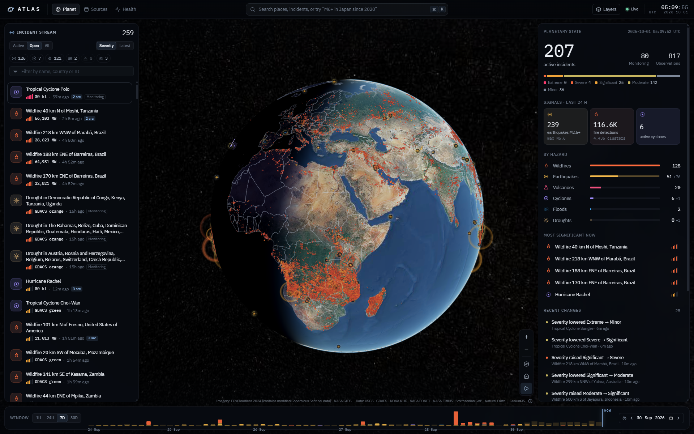
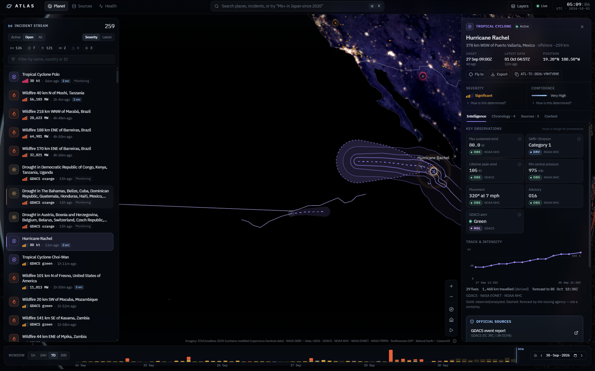
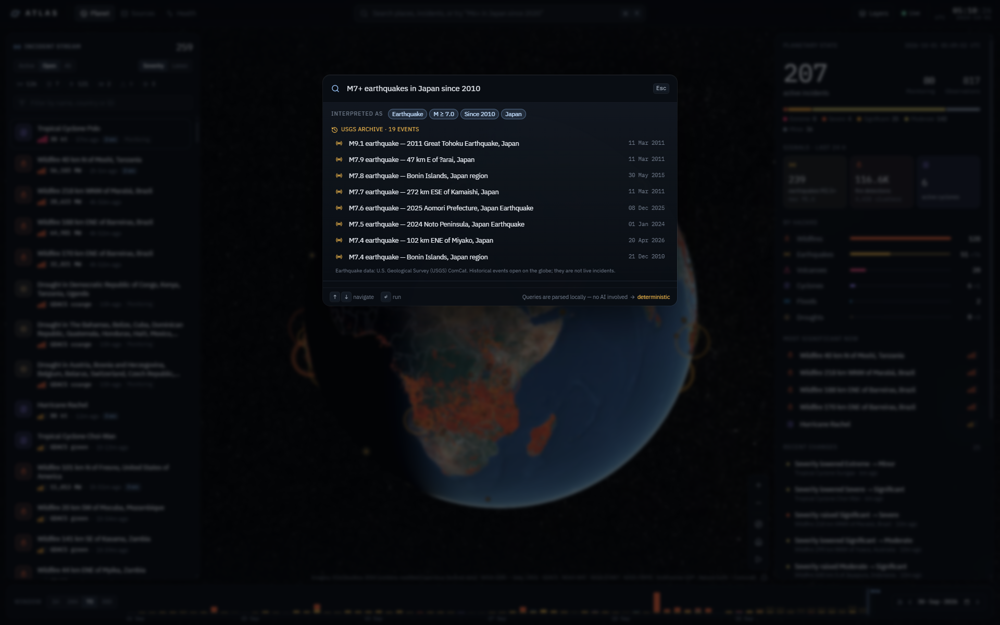
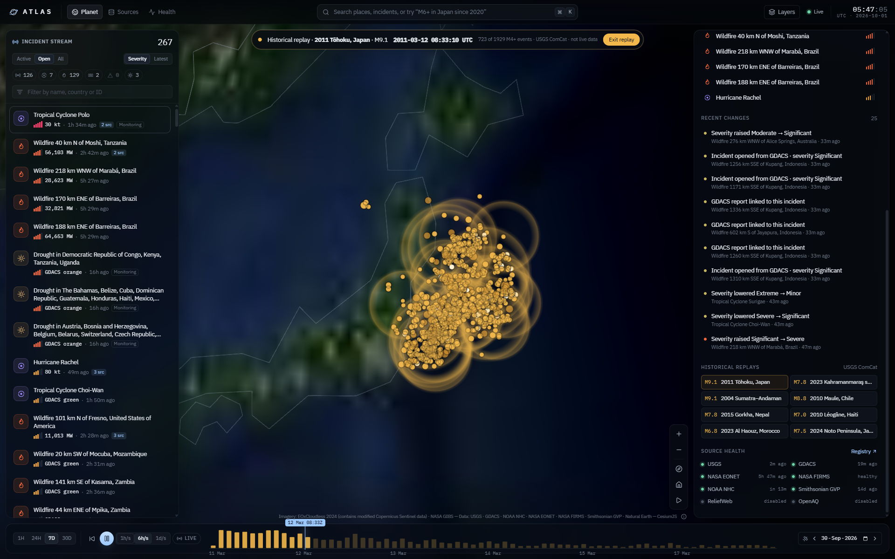
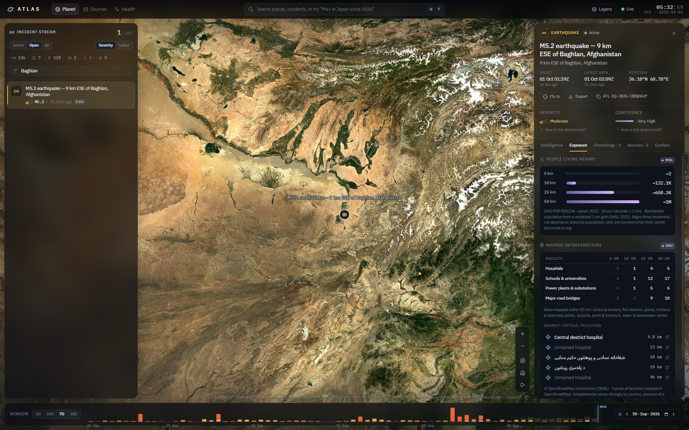
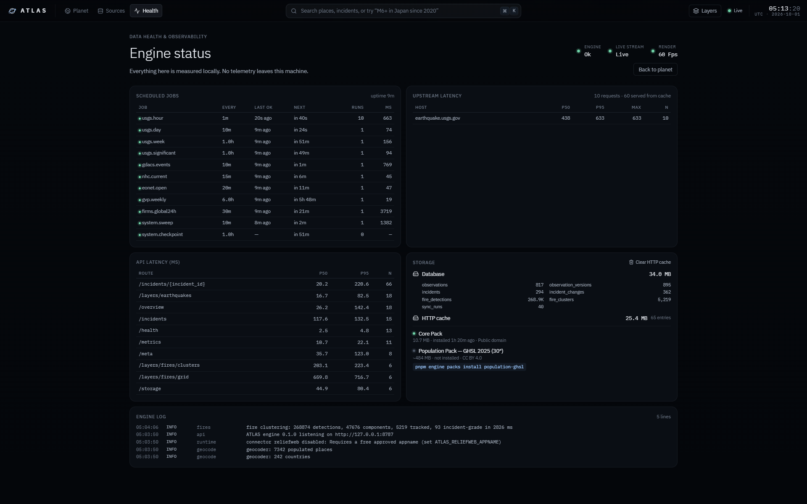
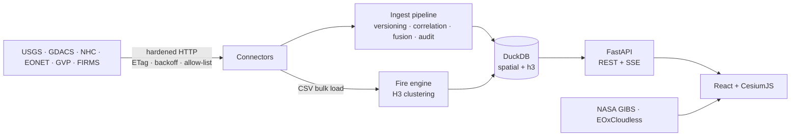

<div align="center">


# ATLAS

**Open planetary disaster intelligence — live, local-first, and honest about every number.**

ATLAS turns the world's open disaster and Earth-observation data into one living planetary
intelligence system: it ingests authoritative feeds, correlates them into single incidents,
tracks how they change, and renders it all on a real-time 3D Earth.

`₹0 required operating cost` · `no account` · `no API keys required` · `no telemetry`

**[Open the public snapshot →](https://arnav-dugad.github.io/ATLAS/)** &nbsp;·&nbsp; rebuilt every 3 hours from open data · run it locally for the live stream



</div>

---

## What it does

- **Live planet.** Sentinel-2 cloudless imagery, the real sun position, city lights on the night side, every M2.5+ earthquake, ~270,000 NASA FIRMS fire detections and active cyclone tracks with agency forecast cones, refreshed continuously.
- **One incident per real event.** USGS, GDACS, NOAA NHC, NASA EONET, Smithsonian GVP and NASA FIRMS reports are **correlated** (shared identifiers first, then hazard-specific space–time–name matching) into stable `ATL-…` incidents instead of duplicates.
- **Provenance on every number.** Each metric is labelled *Observed*, *Derived*, *Model estimate*, *Simulation* or *Unavailable*, and names its source and method. ATLAS never invents values. Where data is missing it says so.
- **Replay history.** Press play (or `Space`) and the planet replays the window at 1 h – 1 day per second: the real sun position follows the playhead, earthquakes appear at their true times with arrival ripples, incidents materialise at onset. Layers that only describe the present (48 h fire detections) step aside during replay.
- **Demo Mode — real historical replays.** Eight curated USGS ComCat sequences (2011 Tōhoku, 2023 Kahramanmaraş, 2004 Sumatra, 2010 Maule, 2015 Gorkha, 2010 Haiti, 2023 Morocco, 2024 Noto) ship as a 135 KB asset, so presentations work offline. Each replays the mainshock and every M4+ event within 300 km over 7 days, with the sun at the true historical angle. Clearly labelled historical — never mixed with live data.
- **Change, not replacement.** Magnitude revisions, alert escalations, intensity changes and fire-cluster growth are written to an audit trail. A **Data Time Machine** reconstructs what ATLAS knew at any past instant.
- **Transparent assessment.** A documented *Severity Scale* and *Confidence Heuristic*, with the basis and every component one click away ([methodology](docs/METHODOLOGY.md)).
- **Ask in plain language, without AI.** `⌘K` → *"earthquakes above magnitude 6 in Japan during 2024"* is parsed deterministically into filters and answered from the live store or the USGS archive.
- **Exposure.** People living within distance rings (GHSL 2025 1 km grid, optional pack) and exact per-ring counts of OpenStreetMap hospitals, fire stations, schools, airports, ports, power and water facilities and bridges, with the nearest named facilities on the globe. Descriptive, never "people affected".
- **Satellite layers.** 13 NASA GIBS overlays: daily true colour, IMERG precipitation, sea-surface temperature, TROPOMI NO₂/SO₂, aerosols, land-surface temperature, MODIS flood, OPERA surface water, NDVI, population density, relief and labels.
- **A real registry.** Licence, attribution, cadence, latency, limits and live health for every source, plus local observability (job scheduler, latency percentiles, storage, logs).

<table>
<tr>
<td width="50%"></td>
<td width="50%"></td>
</tr>
<tr>
<td><sub><b>Incident intelligence</b> — Hurricane Rachel fused from NHC, GDACS and EONET. Current intensity (NHC) is kept distinct from GDACS's lifetime peak; forecast cone and wind buffers on the globe.</sub></td>
<td><sub><b>Deterministic queries</b> — "M7+ earthquakes in Japan since 2010" → chips + 19 USGS ComCat events, led by the 2011 Tōhoku M9.1.</sub></td>
</tr>
<tr>
<td colspan="2"></td>
</tr>
<tr>
<td colspan="2"><sub><b>Historical replay</b> — 2011 Tōhoku M9.1, one day in: 723 of 1,929 M4+ aftershocks from USGS ComCat, arrival ripples, dusk over Japan at the true sun angle. The timeline shows the sequence's Omori-law decay.</sub></td>
</tr>
<tr>
<td width="50%"></td>
<td width="50%"></td>
</tr>
<tr>
<td><sub><b>Exposure</b> — M5.2 near Baghlan: ~658k people within 25 km (GHSL), mapped hospitals, schools, power and bridges per ring (OpenStreetMap).</sub></td>
<td><sub><b>Observability</b> — scheduler, upstream/API latency percentiles, storage, data packs and engine logs, all local.</sub></td>
</tr>
</table>

## Quick start

```bash
git clone https://github.com/Arnav-Dugad/ATLAS.git
cd ATLAS
pnpm setup   # Python venv + engine, web deps, DuckDB extensions, Core Pack (~11 MB)
pnpm dev     # engine → http://127.0.0.1:8787 · web → http://localhost:5173
```

**Requirements:** Node ≥ 20 with pnpm, Python ≥ 3.11, a WebGL2 browser. Works on Windows,
macOS and Linux; developed on a consumer RTX 4060 laptop. No Docker, database server or keys.

Useful commands:

| Command | What it does |
|---|---|
| `pnpm engine sync all` | One-shot ingestion of every enabled source |
| `pnpm engine serve --no-sync` | Serve cached data only |
| `pnpm engine packs list` | Show data packs (Core, Population) |
| `pnpm test` | Web + engine test suites |
| `pnpm gen:api` | Regenerate TypeScript types from the engine's OpenAPI |

Keyboard: `⌘/Ctrl K` palette · `/` search · `L` layers · `R` rotate · `H` home · `[` `]` time window · `j`/`k` navigate · `Alt+1–3` views · `Esc` back.

## Architecture



- **Engine** (`services/engine`): Python 3.11+, FastAPI, DuckDB (spatial, H3), Shapely, NumPy, PyArrow, httpx. One process, no broker.
- **Web** (`apps/web`): Vite, React 19, TypeScript strict, CesiumJS (no Cesium ion), TanStack Query, zustand, Motion, d3-scale.

Details: [Architecture](docs/ARCHITECTURE.md) · [Data model](docs/DATA_MODEL.md) · [Methodology](docs/METHODOLOGY.md) · [Design system](docs/DESIGN_SYSTEM.md) · [Security](docs/SECURITY.md)

## Data sources

All verified live on 2026-10-01. Full research notes: [docs/DATA_SOURCES.md](docs/DATA_SOURCES.md).

| Source | Use | Licence |
|---|---|---|
| USGS Earthquake Hazards Program | Earthquakes (real-time + ComCat archive) | Public domain |
| GDACS (EC JRC / UN OCHA) | Multi-hazard alerts, cyclone tracks & cones | CC BY |
| NOAA National Hurricane Center | Official advisories | Public domain |
| NASA EONET | Curated natural events | NASA open data |
| Smithsonian / USGS GVP | Weekly volcanic activity | Public domain (citation) |
| NASA FIRMS | VIIRS & MODIS active fires | NASA open data |
| NASA GIBS | Imagery & environmental overlays | NASA open data |
| EOxCloudless | Sentinel-2 2024 cloudless basemap | Non-commercial with attribution |
| Natural Earth | Boundaries & places (offline geocoding) | Public domain |
| Open-Meteo | Weather context (model) | CC BY 4.0 · non-commercial tier |
| ReliefWeb · OpenAQ | Adapters, disabled until a free key/appname is set | per provider |

ATLAS shows the required attribution on the map, in incident source drawers, in exports and
in the attribution dialog.

## Scientific integrity & safety

ATLAS reports what sources **observed**, **estimated** or **forecast**. It does not predict
disasters, issue warnings, or replace official alerts, evacuation orders or emergency
services. Every incident links to the official authorities that published it. Forecast
tracks are labelled as agency forecasts with uncertainty cones.

## Privacy

No accounts, no analytics, no telemetry. Everything runs on your machine. Weather lookups
send only an incident location rounded to ~5 km.

## Status & roadmap

Phase 1 (foundation, live ingestion, correlation, planetary view, incident intelligence) is
complete. From Phase 2: population exposure (GHSL), on-demand OpenStreetMap infrastructure
exposure, historical playback, Demo Mode replays and the free public snapshot on GitHub Pages.
Next: before/after satellite comparison, local AI over typed tools, a simulation lab and a
Tauri desktop app. See [ROADMAP.md](docs/ROADMAP.md).

## Contributing & licence

Contributions welcome. Read [CONTRIBUTING.md](CONTRIBUTING.md), especially the **no fake data**
rule. Code is licensed under [Apache-2.0](LICENSE); data remains under each provider's licence.
