# ATLAS Architecture

ATLAS is a **local-first planetary disaster intelligence system**. One Python process
ingests, normalises, correlates and serves open hazard data; one browser app renders it on a
WebGL globe. There is no required cloud service, account or paid API anywhere in the path.

```
OBSERVE → INGEST → NORMALISE → CORRELATE → ANALYSE → VISUALISE → (SIMULATE → EXPLAIN)
```

## System overview

```mermaid
flowchart LR
  subgraph Upstream["Open data (keyless)"]
    USGS[USGS GeoJSON + FDSN]
    GDACS[GDACS events + geometry]
    NHC[NOAA NHC CurrentStorms]
    EONET[NASA EONET v3]
    GVP[Smithsonian GVP RSS]
    FIRMS[NASA FIRMS global CSV]
    OM[Open-Meteo]
    NE[Natural Earth]
  end

  subgraph Engine["ATLAS Engine — Python, one process"]
    HTTP[Hardened HTTP client<br/>allow-list · ETag · backoff · stale-on-error]
    CONN[Connectors<br/>plug-in DataConnector]
    PIPE[Ingest pipeline<br/>versioning · correlation · fusion · change detection]
    FIRE[Fire engine<br/>DuckDB bulk load · H3 clustering]
    GEO[Offline geocoder<br/>STRtree + gazetteer]
    DB[(DuckDB<br/>spatial + h3)]
    SCHED[Scheduler<br/>backoff · cooldowns]
    API[FastAPI<br/>REST + SSE]
  end

  subgraph Web["ATLAS Web — React + CesiumJS"]
    GLOBE[AtlasGlobe<br/>GPU primitive layers]
    UI[Incident stream · intelligence panel<br/>palette · timeline · registry]
  end

  GIBS[NASA GIBS WMTS] --> GLOBE
  EOX[EOxCloudless WMTS] --> GLOBE
  Upstream --> HTTP --> CONN --> PIPE --> DB
  CONN -- detection files --> FIRE --> DB
  GEO --> PIPE
  SCHED --> CONN
  DB --> API -->|JSON / columnar| UI
  API -->|Server-Sent Events| UI
  UI --> GLOBE
```



### Why this shape

| Decision | Choice | Reasoning |
|---|---|---|
| Globe | **CesiumJS** (`CesiumWidget`, no ion) | True 3D globe with sun-accurate lighting, atmosphere, night-side imagery blending (`dayAlpha`/`nightAlpha`), GPU primitive collections for 100k+ points. Used without Cesium ion, so no account or token. |
| Web framework | **Vite + React 19 + TypeScript (strict)** | The app is a single interactive canvas with panels; SSR adds nothing. A static SPA hosts free on any CDN and wraps cleanly in Tauri later. |
| Engine | **Python + FastAPI** | The geospatial ecosystem (Shapely, H3, DuckDB, rasterio) is strongest in Python. |
| Storage | **Embedded DuckDB** with `spatial` + `h3` | Zero-ops, columnar, fast aggregations over 270k+ fire detections, native Parquet/GeoParquet. PostGIS remains the documented scale-out path (schema uses portable types; JSON stored as text). |
| Live updates | **Server-Sent Events** | One-way, proxy-friendly, auto-reconnect, no broker. |
| Scheduling | In-process asyncio scheduler | A laptop deployment does not need Celery/Redis; jobs have backoff, jitter and manual-refresh cooldowns. |
| Types across the boundary | OpenAPI → `openapi-typescript` | A backend contract change becomes a compile error in the web client (`pnpm gen:api`). |

## Engine internals

```mermaid
sequenceDiagram
  autonumber
  participant S as Scheduler
  participant C as Connector
  participant H as HttpClient
  participant P as IngestPipeline
  participant D as DuckDB
  participant B as EventBus
  S->>C: job (e.g. gdacs.events every 10 min)
  C->>H: GET (If-None-Match / If-Modified-Since)
  H-->>C: 200 body · 304 cached body · stale body on outage
  C->>C: parse → validate → Observation[]
  C->>P: observations (+ complete_snapshot flag)
  P->>D: upsert observations; append version on material change
  P->>P: correlate (external ids → space-time-name scoring)
  P->>P: fuse incident (precedence, severity, confidence, geocode)
  P->>D: upsert incident + audit-trail changes (one transaction)
  P-->>B: incident.created / incident.updated / incident.change
  B-->>Web: SSE
```

### Modules (`services/engine/src/atlas`)

| Module | Responsibility |
|---|---|
| `config.py` | Settings (`ATLAS_*` env, `.env`). Every credential optional. |
| `http/` | `HttpClient` (allow-list, byte ceilings, revalidation, backoff, per-host politeness), `HttpCache` (sidecar metadata), `UrlPolicy`. |
| `connectors/` | One module per source implementing `DataConnector` (`jobs()`, `availability()`, `fetch_historical()`). |
| `models/` | Canonical Pydantic model: `Observation`, `Severity`, `Confidence`, `Metric` (with `Provenance`), `Change`, `TrackPoint`. |
| `store/` | `Database` (DuckDB, write lock, migrations, fatal-error recovery), SQL in `repo.py` + `migrations/`. |
| `engine/correlate.py` | Which incident an observation belongs to. |
| `engine/fusion.py` | Fusing observations into an incident record. |
| `engine/severity.py`, `confidence.py` | Documented, inspectable scoring (see `METHODOLOGY.md`). |
| `engine/changes.py` | Material-change detection → audit trail. |
| `engine/fires.py` | FIRMS bulk load, rolling window, clustering, identity tracking. |
| `engine/geocode.py` | Offline reverse geocoding, place descriptions, gazetteer. |
| `engine/query.py` | Deterministic natural-language query parser. |
| `engine/context.py` | On-demand weather context (Open-Meteo). |
| `jobs/` | Scheduler and thread-safe event bus. |
| `api/` | FastAPI app, typed schemas, read-side query service. |
| `packs.py` | Checksummed data packs with archive-bomb/path-traversal guards. |

### Data volume strategy

The browser never receives the raw data universe:

- **Fires** — ~270k detections/48 h are aggregated server-side to H3 resolution 5 for the global view (≈15k cells) and served as compact column arrays; individual pixels are only requested for the visible bounding box below 1,800 km altitude.
- **Earthquakes** — one columnar payload per time window (~2k rows).
- **Incidents** — summaries for the list; full detail (geometry, observations, audit trail) only for the selected incident.
- **Imagery** — tiles requested per viewport from GIBS/EOX by Cesium; nothing proxied.

## Web internals

```mermaid
flowchart TB
  Store[(zustand UI store<br/>persisted prefs)]
  RQ[(TanStack Query cache)]
  SSE[live.ts<br/>EventSource] -->|debounced invalidation| RQ
  RQ --> Shell
  Store --> Shell
  Shell --> Feed[IncidentFeed<br/>virtualised]
  Shell --> Panel[IncidentPanel / OverviewPanel]
  Shell --> Timeline
  Shell --> Palette[CommandPalette]
  Shell --> GlobeC[Globe.tsx bridge]
  GlobeC --> AG[AtlasGlobe.ts<br/>imperative Cesium wrapper]
  AG -->|BillboardCollection| Incidents
  AG -->|PointPrimitiveCollection| Quakes & Fires
  AG -->|PolylineCollection / GroundPrimitive| Tracks, cones, hulls, borders
```

- **React owns state; `AtlasGlobe` owns the GPU.** Data is pushed through narrow setters
  (`setIncidents`, `setEarthquakes`, `setFireGrid`…). Each layer is one primitive
  collection — a handful of draw calls regardless of feature count.
- **Render on demand.** `requestRenderMode` is on; the loop only requests frames while
  something moves (rotation, pulses, camera flights). The globe pauses entirely when a
  full-page view covers it.
- **Error isolation.** Error boundaries wrap the globe, the stream and the panel; a WebGL
  failure degrades to a designed fallback while data views keep working.

## Deployment modes

| Mode | What runs | Capability |
|---|---|---|
| **Local (full)** | `pnpm dev` — engine + web | Everything: live ingestion, correlation, history, search, exports. |
| **Static demo** (planned, see `DEPLOYMENT.md`) | GitHub Actions cron runs the engine headless and publishes JSON snapshots to GitHub Pages | Read-only, refreshed on a schedule; no SSE, no archive search. |
| **Desktop** (roadmap) | Tauri shell around the static web build + bundled engine | Same as local, single installer. |

## Scaling path (not required)

PostgreSQL + PostGIS replaces DuckDB behind `store/` when multiple writers or very large
histories are needed; the schema already avoids DuckDB-only types. Ingestion workers can
move out of process because connectors only depend on `ConnectorContext`.
