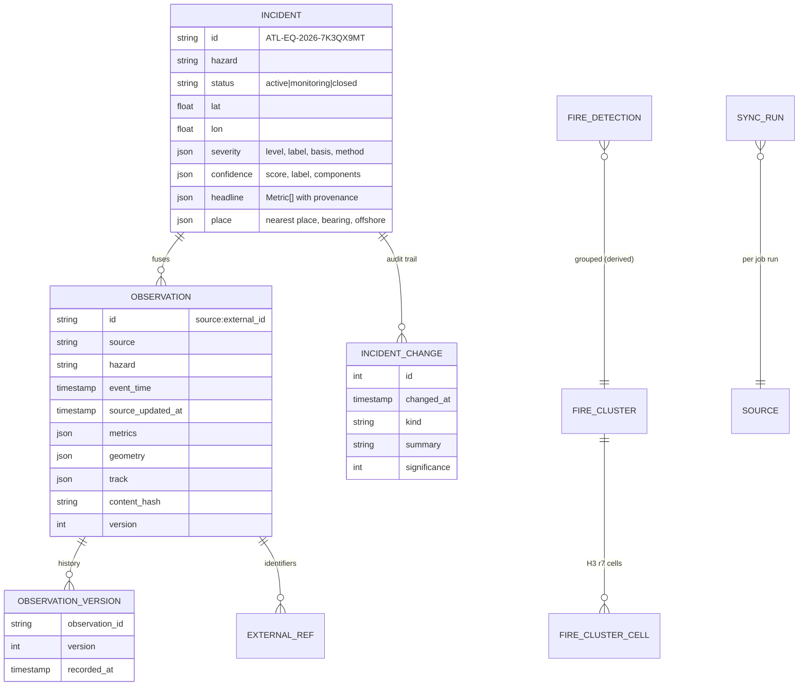

# Data Model

## Canonical entities



### Observation
One upstream record, normalised (`models/core.py::Observation`). Identity is
`"<source>:<external_id>"`. Material changes (values that matter — not timestamps or felt
counts) bump `version` and append an `observation_versions` row.

### Incident
ATLAS's fused view of one real-world event. Identifier format
`ATL-<HAZ>-<YEAR>-<8 Crockford base32>` is deterministic: hashed from the *founding*
observation, so re-ingesting the same upstream data always reproduces the same id (stable
URLs, exports and saved views).

### Metric (headline values)
```json
{ "key": "magnitude", "label": "Magnitude", "value": 6.6, "unit": "mww",
  "provenance": "real", "source": "usgs", "method": null, "note": null,
  "observed_at": "2026-09-30T21:02:11.000Z" }
```

### Change (audit trail)
Kinds: `created`, `source_linked`, `magnitude_revised`, `location_revised`, `depth_revised`,
`alert_changed`, `reviewed`, `retracted`, `tsunami_flag`, `intensity_changed`,
`category_changed`, `pressure_changed`, `cluster_expanded`, `cluster_declined`,
`report_added`, `severity_changed`, `status_changed`, `reassessed` (methodology update).
Significance: 1 info · 2 notable · 3 major.

## Storage

DuckDB file at `data/runtime/atlas.duckdb` (gitignored). Schema in
`services/engine/src/atlas/store/migrations/`. Conventions:

- Timestamps are naive UTC; the API always emits ISO-8601 with `Z`.
- JSON is stored as text for PostgreSQL portability.
- ART indexes only where a primary key is semantically required; never on high-churn
  tables (fire detections and clusters are rewritten every run — see the fatal-error
  investigation in the git history).

## API payload shapes

- **Columnar layers** (`/layers/earthquakes`, `/layers/fires/*`):
  `{ count, columns: { lat: [...], lon: [...], ... }, attribution: [...] }` — compact and
  cache-friendly; the client never parses per-row objects for 100k-point layers.
- **IncidentSummary / IncidentDetail**: generated TypeScript types in
  `apps/web/src/lib/api-types.ts` (`pnpm gen:api`).
- **SSE events** (`/api/v1/stream`): `hello`, `ping`, `incident.created`,
  `incident.updated`, `incident.change`, `source.synced`.
